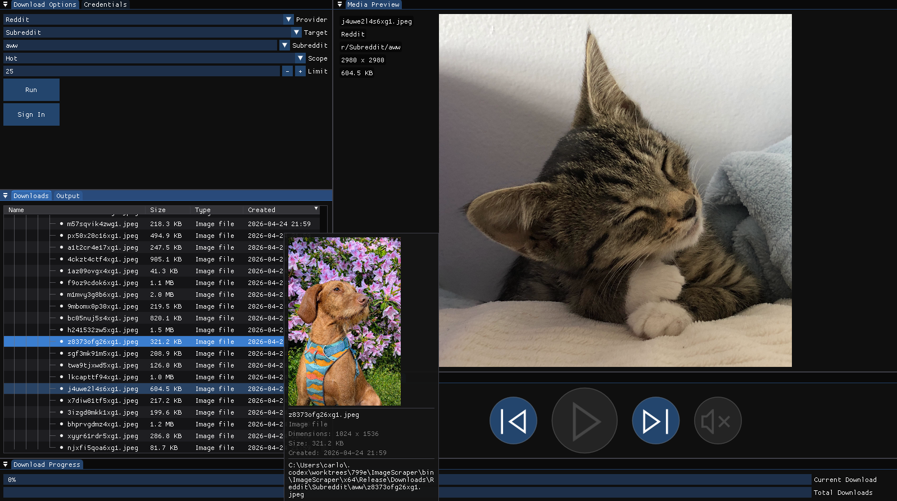

<div align="center">

# ImageScraper

[](https://github.com/carlocgc/ImageScraper/actions/workflows/ci.yml)
[](https://github.com/carlocgc/ImageScraper/releases)


Native Windows desktop application for downloading and previewing media from Reddit, Tumblr, and 4chan.



</div>

## Overview

ImageScraper is a native C++17 desktop application built with Dear ImGui, GLFW, and OpenGL. The project focuses on a responsive local-first experience, clear service boundaries, and a testable architecture.

## Highlights

- Download images, GIFs, galleries, and videos from supported providers
- Preview media inside the app, including animated GIF playback and FFmpeg-backed video playback
- Track download progress and keep a searchable local download history with hover thumbnails
- Sign in to Reddit and Tumblr through a shared OAuth2 flow, while still supporting anonymous modes where available
- Keep the UI responsive by routing network, thumbnail, and preview work through background tasks and main-thread dispatch

## Supported Providers

| Provider | Authentication | Media Types | Status |
| --- | --- | --- | --- |
| Reddit | OAuth2 sign-in, app-only auth | Images, GIFs, videos, galleries | Supported |
| Tumblr | OAuth2 sign-in, API key mode | Images, videos | Supported |
| 4chan | None required | Images, GIFs | Supported |

## Technical Highlights

- **Native desktop stack**: C++17, Dear ImGui, GLFW, OpenGL, and FFmpeg
- **Shared HTTP layer**: `IHttpClient`, `CurlHttpClient`, and `RetryHttpClient` keep request code testable and reusable
- **Reusable OAuth implementation**: `OAuthClient` centralizes browser launch, redirect handling, token exchange, refresh, and persistence for OAuth-backed providers
- **Threaded work orchestration**: `TaskManager` and the thread pool move downloads, thumbnail decoding, and preview preparation off the UI thread
- **Modular UI and service boundaries**: provider panels, services, and sink interfaces keep platform-specific logic isolated
- **Automated validation**: Catch2 unit tests and GitHub Actions CI cover core request, parsing, utility, and threading behavior

## Build

### Prerequisites

- Windows 10 or Windows 11
- Visual Studio 2022 with the **Desktop development with C++** workload
- Windows 10 SDK

Third-party libraries are vendored under `ImageScraper/include/` and `ImageScraper/lib/`, so there is no separate package-manager setup step.

### Visual Studio

1. Open `ImageScraper.sln` in Visual Studio 2022.
2. Select `Debug|x64` or `Release|x64`.
3. Set `ImageScraper` as the startup project.
4. Build the solution.

Build outputs land in `bin/ImageScraper/x64/<Configuration>/`. Required DLLs and runtime data files are copied there automatically.

### PowerShell

```powershell
& 'C:\Program Files\Microsoft Visual Studio\2022\Community\MSBuild\Current\Bin\MSBuild.exe' `
  'ImageScraper.sln' `
  /p:Configuration=Debug `
  /p:Platform=x64 `
  /t:ImageScraper `
  /m /nologo
```

Swap `Debug` for `Release` or `/t:ImageScraper` for `/t:ImageScraperTests` as needed.

## Configuration

Credentials are entered through the in-app **Credentials** panel. User credentials are stored in `config.json` next to the executable, so normal use does not require manual JSON editing.

### Provider setup

**Reddit**

Reddit access currently requires valid existing API credentials. If you have access:

1. Create or reuse a Reddit web app.
2. Set the redirect URI to `http://localhost:8080`.
3. Enter the client ID and client secret in the **Credentials** panel.

**Tumblr**

1. Register an app at [tumblr.com/oauth/apps](https://www.tumblr.com/oauth/apps).
2. Enter credentials in the **Credentials** panel.

- Consumer key only enables API key mode for anonymous access.
- Consumer key and consumer secret enable OAuth sign-in.

**4chan**

No setup is required.

### Local developer convenience

For local development, `ImageScraper/data/config.json` is gitignored and can be copied into the output directory during debug builds. The **Save credentials to source data/** checkbox in the Credentials panel keeps that backup file up to date on your machine without committing secrets to the repository.

## Testing

The recommended local workflow is Visual Studio Test Explorer with the **Test Adapter for Catch2** extension by JohnnyHendriks. `ImageScraper.runsettings` is already included for that setup.

If the **Class** column is empty in Test Explorer, that is expected: Catch2 tests in this project are free functions. Group by traits or tags instead.

### Command-line test run

```powershell
& 'C:\Program Files\Microsoft Visual Studio\2022\Community\MSBuild\Current\Bin\MSBuild.exe' `
  'ImageScraper.sln' `
  /p:Configuration=Debug `
  /p:Platform=x64 `
  /t:ImageScraperTests `
  /m /nologo

.\bin\ImageScraperTests\x64\Debug\ImageScraperTests.exe
```

CI runs the same test binary explicitly after the build step, rather than launching tests as a post-build side effect.

## Project Layout

- `ImageScraper/` - application source, UI panels, provider services, networking, and media preview code
- `ImageScraperTests/` - Catch2 unit tests for request handling, utilities, threading, JSON IO, and shared helpers
- `docs/` - refactor notes and longer-form engineering documentation
- `.github/workflows/ci.yml` - Windows CI build and test workflow

## Current Scope

- Windows only
- Native desktop UI only, no web version
- Reddit and Tumblr require user-supplied credentials for authenticated access

## Third-Party Software

Key libraries used by the project include FFmpeg, Dear ImGui, GLFW, libcurl, curlpp, nlohmann/json, stb_image, cppcodec, and Catch2.

Full third-party license information is available in [THIRD_PARTY_LICENSES.md](THIRD_PARTY_LICENSES.md).

## License

This project is licensed under the MIT License. See [LICENSE.txt](LICENSE.txt) for details.
